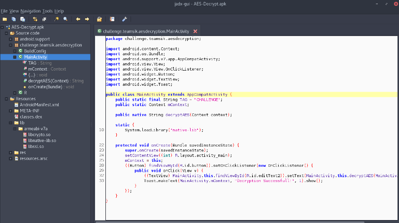

# AHE17 : Android Hacking Events 2017

## **AES-Decrypt** ([AES-Decrypt.apk](https://team-sik.org/wp-content/uploads/2017/06/AES-Decrypt.apk_.zip) - Belgium in the Dashboard)

**Hint**

It's right in front of you, just decrypt it!

## Write-up

by [svetrini](https://github.com/ningod)

Let's start by running the challenge inside an emulator, the interface shows us two text box and a button.

> +NvwsZ48j3vyDIaMu6LrjnNn8/OAnexGUXn3POeavI8=

> T9WoXhrsQHgY3NLr8SwBbw==

Pushing the button, the first field is *decrypted* to

> *Key=AF03BC291F82*

Obviously this is not the flag and also trying to decrypt the second field with AES using this key and some simple IV, it doesn't work.

### Static Analysis

Let's see inside  `AES-Decrypt.apk` with a decompiler like [jadx or with jadx-gui](https://github.com/skylot/jadx)
```bash
$ jadx -d AES-Decrypt.jadx AES-Decrypt.apk
[...]
$ tree AES-Decrypt.jadx/challenge
AES-Decrypt.jadx/challenge
└── teamsik
    └── aesdecryption
        ├── BuildConfig.java
        ├── MainActivity.java
        └── R.java

2 directories, 3 files
```


We can see the `MainActivity.java` is the first activity loaded at the startup as described in 'AndroidManifest.xml', and inside we notice a call to native library that is the application's core.

```xml
<?xml version="1.0" encoding="utf-8" standalone="no"?>
<manifest xmlns:android="http://schemas.android.com/apk/res/android" package="org.team_sik.ahe17.esoteric" platformBuildVersionCode="25" platformBuildVersionName="7.1.1">
    <meta-data android:name="android.support.VERSION" android:value="25.3.0"/>
    <application android:allowBackup="true" android:debuggable="true" android:icon="@mipmap/ic_launcher" android:label="@string/app_name" android:roundIcon="@mipmap/ic_launcher_round" android:supportsRtl="true">
        <activity android:name="org.team_sik.ahe17.esoteric.SuperActivity">
            <intent-filter>
                <action android:name="android.intent.action.MAIN"/>
                <category android:name="android.intent.category.LAUNCHER"/>
            </intent-filter>
        </activity>
    </application>
</manifest>
```
```java
public native String decryptAES(Context context);

static {
    System.loadLibrary("native-lib");
}
```

Opening the `AES-Decrypt.apk` application file with [apktool](https://ibotpeaches.github.io/Apktool/), we can see lib folder with some native files:

```bash
$ apktool d -f -o AES-Decrypt.apktool AES-Decrypt.apk
[...]
$ tree AES-Decrypt.apktool
AES-Decrypt.apktool
├── AndroidManifest.xml
├── apktool.yml
├── lib
│ └── armeabi-v7a
│     ├── libcrypto.so
│     ├── libnative-lib.so
│       └── libssl.so
├── original
[...]
191 directories, 2233 files
```

Looking inside the `lib/armeabi-v7a` folder, in addition to the expected file `libnative-lib.so` we see some common native libraries used for cryptography, `libcypto.so` and `libssl.so`

Next step is to perform some static analysis on the native code using [radare2](https://rada.re/r/).

We start looking for functions called by *JNI* and for strings inside the code.

```
$ r2 libnative-lib.so
[0x0000347c]> aaa #analysis
[x] Analyze all flags starting with sym. and entry0 (aa)
[ ]
[aav: using from to 0x0 0x12618
Using vmin 0x134 and vmax 0x17f35
aav: using from to 0x0 0x12618
Using vmin 0x134 and vmax 0x17f35
[x] Analyze len bytes of instructions for references (aar)
[x] Analyze function calls (aac)
[ ] [*] Use -AA or aaaa to perform additional experimental analysis.
[x] Constructing a function name for fcn.* and sym.func.* functions (aan))
```

```bash
[0x0000347c]> iE #Exports (global symbols)
[Exports]
[...]
vaddr=0x00003518 paddr=0x00003518 ord=003 fwd=NONE sz=1228 bind=GLOBAL type=FUNC name=Java_challenge_teamsik_aesdecryption_MainActivity_decryptAES
[...]
```

```bash
[0x00003518]> pdf #disassemble function
/ (fcn) sym.Java_challenge_teamsik_aesdecryption_MainActivity_decryptAES 1072
|   sym.Java_challenge_teamsik_aesdecryption_MainActivity_decryptAES ();
[...]
|           0x00003906      00f0a7f8       bl sub.EVP_CIPHER_CTX_new_a58
|           0x0000390a      b0f1ff3f       cmp.w r0, -1                ; r7
|       ,=< 0x0000390e      07d0           beq 0x3920
|       |   0x00003910      0021           movs r1, 0
|       |   0x00003912      3154           strb r1, [r6, r0]
|       |   0x00003914      3146           mov r1, r6
|       |   ; UNKNOWN XREF from 0x00002d48 (unk)
|       |   0x00003916      d8f80000       ldr.w r0, [r8]
|       |   0x0000391a      d0f89c22       ldr.w r2, [r0, 0x29c]
|      ,==< 0x0000391e      05e0           b 0x392c
|      ||   ; JMP XREF from 0x0000390e (sym.Java_challenge_teamsik_aesdecryption_MainActivity_decryptAES)
|      | -> 0x00003920      d8f80000       ldr.w r0, [r8]
|      |    0x00003924      2b49           ldr r1, [0x000039d4]        ; [0x39d4:4]=0xbe6a
|      |    0x00003926      d0f89c22       ldr.w r2, [r0, 0x29c]
|      |    0x0000392a      7944           add r1, pc
|      |    ; JMP XREF from 0x0000391e (sym.Java_challenge_teamsik_aesdecryption_MainActivity_decryptAES)
|       --> 0x0000392c      4046           mov r0, r8
|           0x0000392e      9047           blx r2
[...]
```

```bash
[0x00003518]> iz #Strings in data sections
[...]
vaddr=0x0000f788 paddr=0x0000f788 ordinal=000 sz=10 len=9 section=.rodata type=ascii string=CHALLENGE
vaddr=0x0000f792 paddr=0x0000f792 ordinal=001 sz=6 len=5 section=.rodata type=ascii string=0x%2x
vaddr=0x0000f798 paddr=0x0000f798 ordinal=002 sz=18 len=17 section=.rodata type=ascii string=Invalid key used!
vaddr=0x0000f7aa paddr=0x0000f7aa ordinal=003 sz=21 len=20 section=.rodata type=ascii string=Initalizing OpenSSL:
vaddr=0x0000f7bf paddr=0x0000f7bf ordinal=004 sz=45 len=44 section=.rodata type=ascii string=0fk8j09RWT8+bKFQ0BdwRVjM+PuM5GeauUORaOtuP5A=
vaddr=0x0000f7ec paddr=0x0000f7ec ordinal=005 sz=65 len=64 section=.rodata type=ascii string=0fk8j09RWT8+bKFQ0BdwRTwVQHvav+HIQH3zWg0UtCw8RCtgr772N3KAfKdWMKZN
vaddr=0x0000f82d paddr=0x0000f82d ordinal=006 sz=45 len=44 section=.rodata type=ascii string=0fk8j09RWT8+bKFQ0BdwRWYaE95rIj008XoTqeq1YJU=
vaddr=0x0000f85a paddr=0x0000f85a ordinal=007 sz=45 len=44 section=.rodata type=ascii string=0fk8j09RWT8+bKFQ0BdwRVw0J6O9tU1N3bUR4SpMgIE=
vaddr=0x0000f887 paddr=0x0000f887 ordinal=008 sz=45 len=44 section=.rodata type=ascii string=pJolsMEG1ZjA39Z0RdSfbtgf/6QqiXXgLDYZWMRIpno=
vaddr=0x0000f8b4 paddr=0x0000f8b4 ordinal=009 sz=65 len=64 section=.rodata type=ascii string=5XN3JZ0qQnZOlVT+FvZutMspEknw0l2ylINvmahr58xEQL4+3GEWnF/ojZ8OwwdZ
vaddr=0x0000f8f5 paddr=0x0000f8f5 ordinal=010 sz=65 len=64 section=.rodata type=ascii string=5XN3JZ0qQnZOlVT+FvZutEVENxTKdhobEn9okV2h5Bj8PXPBkbRrEEDjxknjA16H
vaddr=0x0000f936 paddr=0x0000f936 ordinal=011 sz=65 len=64 section=.rodata type=ascii string=u9o2dJItY/yt633wMhsDP2BaKb9kHJm/HZtwOe4L1ADV+U+aiHgpGhZ7EEaEcHq9
vaddr=0x0000f977 paddr=0x0000f977 ordinal=012 sz=45 len=44 section=.rodata type=ascii string=ZrnY4AKdp5ByAoHREWtYv+NamtJA/p0Swvc6D6u7qx0=
vaddr=0x0000f9a4 paddr=0x0000f9a4 ordinal=013 sz=45 len=44 section=.rodata type=ascii string=P2m808wtZdzcP9ouyfWvjoGLm2jZi0D4uK5YnjsP+B4=
[...]
```

Unlucky there are too much strings for a static analysis and the code of the JNI function is way too complex to be analyzed only with static tool.
We change approach and check if the openssl libraries are used for encryption/decryption with *AES_256_CBC* algorithm, as the challenge title suggests.

```bash
[0x0000347c]> ii #Imports
[Imports]
[...]
ordinal=028 plt=0x00003038 bind=GLOBAL type=FUNC name=EVP_aes_256_cbc
ordinal=029 plt=0x00003044 bind=GLOBAL type=FUNC name=EVP_DecryptInit_ex
ordinal=030 plt=0x00003050 bind=GLOBAL type=FUNC name=EVP_DecryptUpdate
ordinal=031 plt=0x0000305c bind=GLOBAL type=FUNC name=EVP_DecryptFinal_ex
ordinal=032 plt=0x00003068 bind=GLOBAL type=FUNC name=EVP_CIPHER_CTX_free
ordinal=033 plt=0x00003074 bind=GLOBAL type=FUNC name=ERR_load_crypto_strings
ordinal=034 plt=0x00003080 bind=GLOBAL type=FUNC name=OPENSSL_add_all_algorithms_noconf
ordinal=035 plt=0x0000308c bind=GLOBAL type=FUNC name=OPENSSL_config
[...]
```

```bash
[0x00003a56]> axt sym.imp.EVP_DecryptInit_ex #find data/code references to this address
code 0x3502 b sym.imp.EVP_DecryptInit_ex in unknown function
call 0x3aa6 blx sym.imp.EVP_DecryptInit_ex in sub.EVP_CIPHER_CTX_new_a58

[0x00003a56]> axt sub.EVP_CIPHER_CTX_new_a58 #find data/code references to this address
call 0x3906 bl sub.EVP_CIPHER_CTX_new_a58 in sym.Java_challenge_teamsik_aesdecryption_MainActivity_decryptAES
call 0x3be2 bl sub.EVP_CIPHER_CTX_new_a58 in sub.strlen_bb0
[0x00003a56]>
```
After this step we move on to dynamic analysis.

### Dynamic Analysis

The tool used is [frida](https://www.frida.re/).
We can use it to hook interesting native functions, and intercept parameters. In this case the function we want to hook is **EVP_DecryptInit_ex** because its parameters are the *Key* and *IV* for AES as describen on OpenSSL [Wiki](https://wiki.openssl.org/index.php/Manual:EVP_EncryptInit(3))

```c
#include <openssl/evp.h>

void EVP_CIPHER_CTX_init(EVP_CIPHER_CTX *a);

int EVP_EncryptInit_ex(EVP_CIPHER_CTX *ctx, const EVP_CIPHER *type, ENGINE *impl, unsigned char *key, unsigned char *iv);
int EVP_EncryptUpdate(EVP_CIPHER_CTX *ctx, unsigned char *out, int *outl, unsigned char *in, int inl);
int EVP_EncryptFinal_ex(EVP_CIPHER_CTX *ctx, unsigned char *out, int *outl);

int EVP_DecryptInit_ex(EVP_CIPHER_CTX *ctx, const EVP_CIPHER *type, ENGINE *impl, unsigned char *key, unsigned char *iv);
int EVP_DecryptUpdate(EVP_CIPHER_CTX *ctx, unsigned char *out, int *outl, unsigned char *in, int inl);
int EVP_DecryptFinal_ex(EVP_CIPHER_CTX *ctx, unsigned char *outm, int *outl);
[...]*
```
We can use a python [script](aesnative.py) to achieve the goal; the python script is only an helper for the following frida javascript code:

```js

console.log("Starting frida hooks on Process.arch:: "+Process.arch);

var decrypt = undefined;

var imports = Module.enumerateImportsSync("libnative-lib.so");

for(i = 0; i < imports.length; i++) {
    console.log("imports["+i+"].name : "+imports[i].name)
    if(imports[i].name == "EVP_DecryptInit_ex") {
        decrypt = imports[i].address;
    }
}


if(decrypt){
    console.log("decrypt found at address: "+decrypt);
    Interceptor.attach(decrypt, {
                onEnter: function (args) {

                    //The Key in AES 256 is composed by 32 byte
                    var rawParamKey = Memory.readByteArray(ptr(args[3]),32);
                    var paramHexDump =hexdump(rawParamKey, { offset: 0, length: 32, header: true, ansi: true });

                    var msg = "[*] D Key "+ 3 + " " + args[3];
                    send("KEY",rawParamKey);
                    console.log(msg);
                    console.log(paramHexDump);

                    //The Key in IV 256 is composed by 16 byte
                    var rawParamIv = Memory.readByteArray(ptr(args[4]),16);                    
                    var paramHexDump = hexdump(rawParamIv, { offset: 0, length: 16, header: true, ansi: true });

                    var msg = "[*] D IV "+ 4 + " " + args[4];
                    send("IV",rawParamIv);
                    console.log(msg);
                    console.log(paramHexDump);
                }
    });
}

```
After pushing the decrypt button on the application, we got the following output:
```bash
$ python aesnative.py challenge.teamsik.aesdecryption
[+] Waiting for app called challenge.teamsik.aesdecryption
[*] Attached on process
[*] Press enter to exit...
Starting frida hooks on Process.arch:: arm
decrypt found at address: 0xaf0b5180
KEY B64 --> /Rr4FmE7Yk40h4n1rjs05cqHP74GeESQWdyj0rvpiUE=
[*] D Key 3 0xaf241d66
           0  1  2  3  4  5  6  7  8  9  A  B  C  D  E  F  0123456789ABCDEF
00000000  fd 1a f8 16 61 3b 62 4e 34 87 89 f5 ae 3b 34 e5  ....a;bN4....;4.
00000010  ca 87 3f be 06 78 44 90 59 dc a3 d2 bb e9 89 41  ..?..xD.Y......A
IV B64 --> JTBd9Mq7+I01oMCVVPOwAg==
[*] D IV 4 0xaf241d86
           0  1  2  3  4  5  6  7  8  9  A  B  C  D  E  F  0123456789ABCDEF
00000000  25 30 5d f4 ca bb f8 8d 35 a0 c0 95 54 f3 b0 02  %0].....5...T...


00000000  25 30 5d f4 ca bb f8 8d 35 a0 c0 95 54 f3 b0 02  %0].....5...T...
KEY B64 --> /Rr4FmE7Yk40h4n1rjs05cqHP74GeESQWdyj0rvpiUE=
[*] D Key 3 0xaf241d66
           0  1  2  3  4  5  6  7  8  9  A  B  C  D  E  F  0123456789ABCDEF
00000000  fd 1a f8 16 61 3b 62 4e 34 87 89 f5 ae 3b 34 e5  ....a;bN4....;4.
00000010  ca 87 3f be 06 78 44 90 59 dc a3 d2 bb e9 89 41  ..?..xD.Y......A
IV B64 --> JTBd9Mq7+I01oMCVVPOwAg==
[*] D IV 4 0xaf241d86
           0  1  2  3  4  5  6  7  8  9  A  B  C  D  E  F  0123456789ABCDEF
00000000  25 30 5d f4 ca bb f8 8d 35 a0 c0 95 54 f3 b0 02  %0].....5...T...
KEY B64 --> AMKyAMuv7U4Us1KTVjb2AGV8QGy7jynAoU+77LatjlQ=
[*] D Key 3 0x9e2b9f60
           0  1  2  3  4  5  6  7  8  9  A  B  C  D  E  F  0123456789ABCDEF
00000000  00 c2 b2 00 cb af ed 4e 14 b3 52 93 56 36 f6 00  .......N..R.V6..
00000010  65 7c 40 6c bb 8f 29 c0 a1 4f bb ec b6 ad 8e 54  e|@l..)..O.....T
IV B64 --> mT92BqeIHGdJJ2YGjenYqg==
[*] D IV 4 0xaf241d56
           0  1  2  3  4  5  6  7  8  9  A  B  C  D  E  F  0123456789ABCDEF
00000000  99 3f 76 06 a7 88 1c 67 49 27 66 06 8d e9 d8 aa  .?v....gI'f.....


```
We notice that during the test the function is called many times but only two Key/IV couples are used.

> Key_1 : /Rr4FmE7Yk40h4n1rjs05cqHP74GeESQWdyj0rvpiUE=

> IV_1 :  JTBd9Mq7+I01oMCVVPOwAg==

> Key_2 : AMKyAMuv7U4Us1KTVjb2AGV8QGy7jynAoU+77LatjlQ=

> IV_2 :  mT92BqeIHGdJJ2YGjenYqg==

Testing both of them on the first cipher text shown by the app we find the correct one: Key_2, IV_2.
Now we can use the couple to extract the flag from the second field.

>  FLAG:   A H	E	1	7	{	F	r	i	d	a	!	}

That's all folks!
