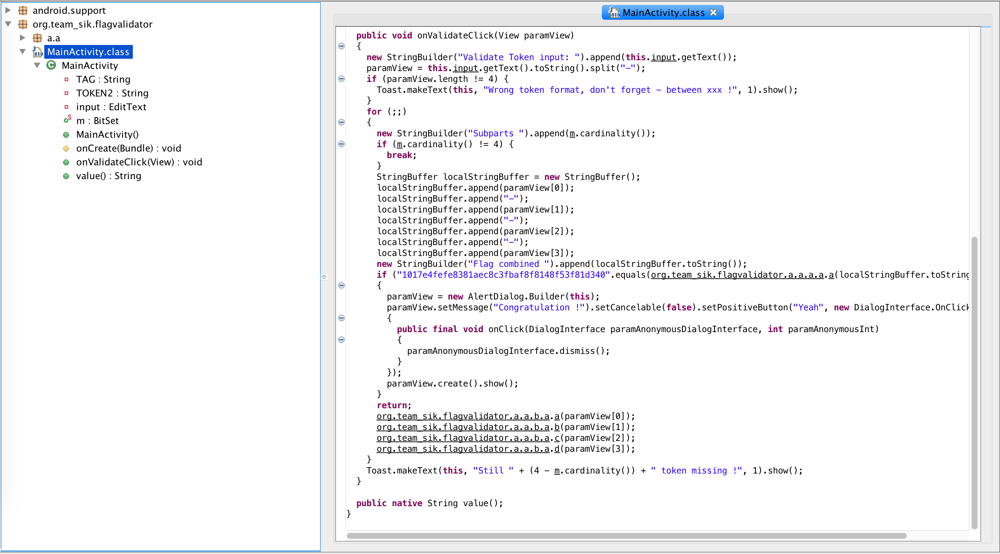
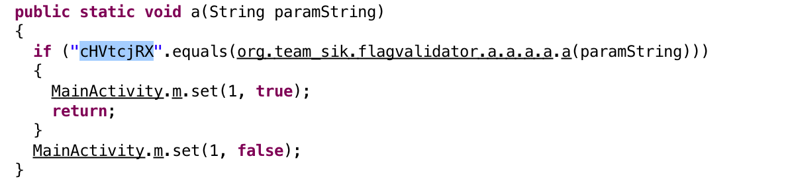
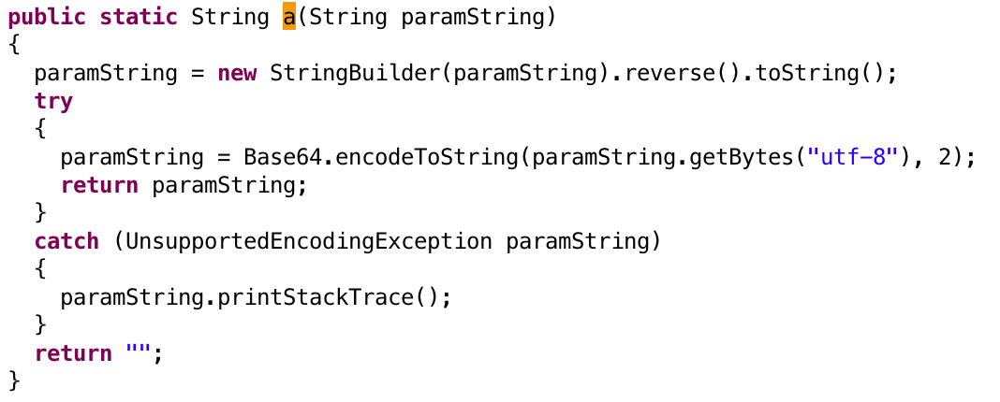
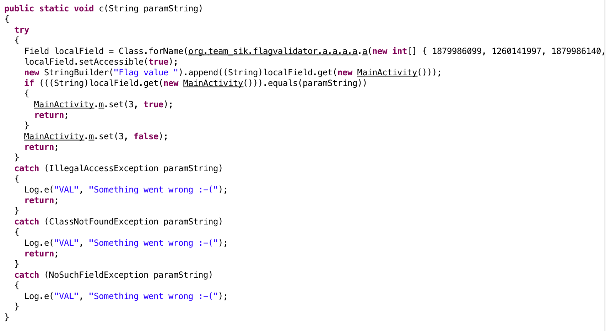
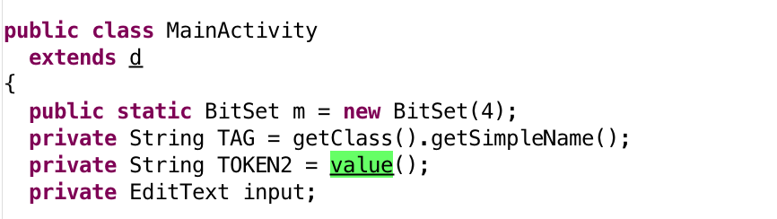
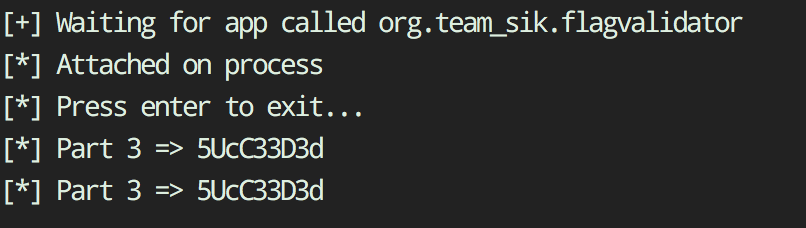
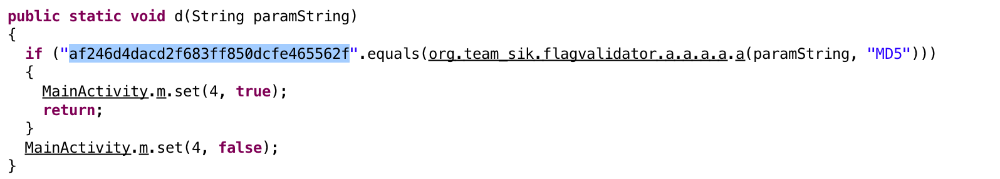

# FlagValidator - WriteUp
**Type**: Reversing
**Points**: 150
**Decription**: *If you enter a flag in the app it will validate if it is the correct flag. To find the correct flag, which the validator will accept, just reverse the app. If you find the correct flag, please put the flag for submission into AHE17{THEFLAG} .*

## Write-Up
FlagValidator it's an android reversing challange in order to obtain the flag we were tasked to insert a flag in the format of (***XXX-XXX-XXX-XXX***).
So let's dig deeper and let's decompile the application, I used unzip, dex2jar, JDGui and frida in order to complete this challange. Using unzip and dex2jar I extracted a jar file form the apk, the decompiled file was something similar.

As can be seen above the entrypoin is **MainActivity.java** and **onValidateClick** is the handler for the onClick event once user click *Validate* button, we can easly understand that the flag is composed from 4 parts, each part is validated using different methods:

1)      org.team_sik.flagvalidator.a.a.b.a.a(paramView[0]);
2)      org.team_sik.flagvalidator.a.a.b.a.b(paramView[1]);
3)      org.team_sik.flagvalidator.a.a.b.a.c(paramView[2]);
4)      org.team_sik.flagvalidator.a.a.b.a.d(paramView[3]);

where paramView is the array with the full flag.
### Part 1
Let's start by looking at **org.team_sik.flagvalidator.a.a.b.a.a** and try to understand how this part will be validated. The first part compare the result of **org.team_sik.flagvalidator.a.a.a.a.a** with the string ***cHVtcjRX*** which is likely to be a base64 string, after looking at the method above I confirmed that is was a base64, the following actions was performed from the application:

1) Take part one from the TextInput
2) Reverse it
3) Make base64 string
4) Compare with cHVtcjRX

This is pretty easy, in order to obtain the first part we can simply do the following
```python -c "import base64; print base64.b64decode('cHVtcjRX')[::-1]"```
The result was **W4rmup**


### Part 2
For the second part I looked at the method **org.team_sik.flagvalidator.a.a.b.a.b**, this method perform some calcuation with an array called **a** (the same calculation used in part 2), then the result is compared with our string, below a screenshot of the method:

Looking at the logic I made a small python script which simulate the execution:
```python
l = [-1602723372, 811074983, -1602723401, 811075023, -949198329, 1053776347, -1602723400, 811074964, -949198243, 1053776336, -1602723353, -949198285, 1053776311]
l = [x % 256 for x in l]
tmp = ""
i = 2
j = l[0]
k = l[1]
m = l[len(l)-2]
n = l[len(l)-1]
while i < len(l) -2:
    tmp += chr(l[i] ^ [j,k,m,n][(i-2)%4])
    i += 1

print tmp
```
The result from the execution was **ch4ll3ng3**
### Part 3
The third part was obtained from reflection and a native library , first the application load the MainActivity class using reflection then try to compare a field called TOKEN2 with our string as show from the screenshots.


Since i'm not really good at reversing native binary I tried to find the correct part using dynamic instrumentation, here's where frida comes in help. I created a frida script which once runned , hooks the native method value and show the result from the native call.
```javascript
Java.perform(function() {

    var classDef = Java.use('org.team_sik.flagvalidator.MainActivity');

    var nativeValue = classDef.value;

    nativeValue.implementation = function(){
        var ret = nativeValue.call(this);
        send("Part 3 => " + ret);
        return ret;
    }
});
```

### Part 4
Part 4 was the easiest , it simply use the method **org.team_sik.flagvalidator.a.a.b.a.d** to compare the MD5 hash of our string with **af246d4dacd2f683ff850dcfe465562f** , a quick search on google show that this is the MD5 for the plaintext **continue1**



### The flag
Concataning all the above parts we got **AHE17{W4rmup-ch4ll4ng3-5UcC33D3d-continue1}**

